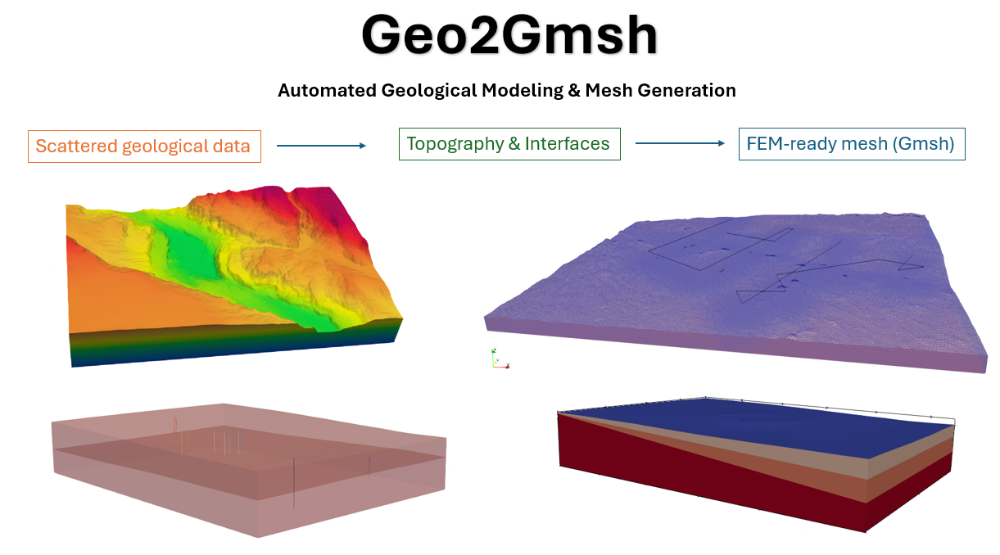

# **Geo2Gmsh**


**Geo2Gmsh** v.1.0 [](https://doi.org/10.5281/zenodo.19270810)

Geo2Gmsh is a modular Python-based workflow designed to bridge geoscientific datasets with advanced mesh generation capabilities provided by Gmsh. The tool enables the systematic construction of three-dimensional computational meshes from geological input data, including structured coordinate files, stratigraphic horizons, and fault geometries.

The methodology implemented in Geo2Gmsh formalizes the transformation of discrete geological information into conforming volumetric meshes suitable for numerical simulation. In particular, the workflow:

Automates the generation of 3D meshes from sparse or irregularly distributed geological data.
Incorporates local mesh refinement strategies around key geological features such as wells, faults, and interfaces.
Assigns physical group identifiers, ensuring compatibility with downstream numerical solvers (e.g., finite element or finite volume methods).
Provides a reproducible and extensible framework for mesh construction in geoscientific applications.

From a computational perspective, Geo2Gmsh leverages the scripting and API capabilities of Gmsh, a widely used tool for generating unstructured meshes in numerical modeling . By abstracting low-level meshing operations, the workflow reduces the barrier for geoscientists to construct high-quality meshes while maintaining flexibility for advanced users.

This tool is particularly relevant for applications in:

* Geothermal reservoir modeling;
* Basin-scale thermal simulations;
* Structural geology and fault system analysis;
* Subsurface flow and transport modeling




To ensure computational reproducibility, Geo2Gmsh incorporates a checksum-based validation procedure. This mechanism allows users to verify that generated meshes are consistent across different systems and executions.

After running the workflow, output files are automatically compared against reference results using hash-based checksums. This ensures that:

* The mesh generation process is deterministic
* Results are independent of the execution environment
* Any discrepancies due to implementation or system differences are detected

This reproducibility framework provides a robust mechanism for validating the integrity of the workflow and supports its use in scientific and engineering applications where consistency is critical.

#### **🌍 Overview**


Geo2Gmsh enables the automated generation of 3D unstructured geological meshes from simple input files.

The workflow operates on text files (.txt) containing triplets of spatial coordinates (x, y, z) representing points that define:


* Horizontal or near-horizontal surfaces representing topography or lithological interfaces
* Steep surfaces representing faults
* Linear trajectories representing wells


###### **Key capabilities include:**


* Automatic construction of geological surfaces and volumes
* Integration of faults and wells into the mesh
* Local refinement around geological features
* Assignment of physical group identifiers for use in external numerical solvers
* Export of mesh files in common formats (e.g., .msh, .vtk, etc)


As a result, Geo2Gmsh offers a reproducible and efficient pipeline for the generation of meshes suitable for geoscientific simulations.


#### **📦 Repository Structure**


```

Geo2Gmsh/

│

├── Geo2Gmsh.py                 # Core module with mesh generation functions

├── test_checksum.py            # Run a test of the examples meshes to ensure reproducibility

├── README.md                   # Project overview and instructions

├── LICENSE                     # License information

├── environment.yml             # Conda environment configuration

├── requirements.txt            # Python dependencies

├── docs/                       # Documentation folder

│   ├── images/                 # Folder for images used in documentation

│   ├── user_guide.md           # Detailed user guide for Geo2Gmsh

│

└── examples/                   # Folder with example workflows

	 ├── overview/               # Example 1: Overview example workflow

   	 │   ├── run_overview.py     # Executable workflow

	 │   ├── master_script.ipynb # Interactive notebook to configure and customize workflow

	 │   ├── outputs/            # Folder for generated results (e.g., .msh, .vtk)

	 │   ├── preprocessing/      # Folder for QGIS project and related files

	 │   └── data/               # Input datasets (.txt)

	 │       ├── layers/         # Interface definitions from (x, y, z) coordinate triplets

 	 │       ├── wells/          # Well trajectory data from (x, y, z) coordinate triplets

	 │       └── faults/         # Fault traces defined from (x, y, z) coordinate triplets

	 │

	 ├── test_ringvent/           # Example 2: Ringvent example workflow

	 │   ├── run_ringvent.py      # Executable workflow

	 │   ├── master_script.ipynb

	 │   ├── outputs/

	 │   └── data/

	 │       ├── layers/

	 │       ├── wells/

	 │       └── faults/

	 │

	 └── test_llanos/             # Example 3: Llanos example workflow

	       ├── run_llanos.py        # Executable workflow

	       ├── master_script.ipynb

	       ├── outputs/

	       └── data/

	           ├── layers/

	           ├── wells/

	           └── faults/

```

Each example is self-contained and fully reproducible.


# **Quick Start**


#### **⚙️ Installation**


After installing Anaconda (version 23.11.0 or later) on your system, follow these steps from an Anaconda Prompt:


###### **1. Clone repository**


```bash
git clone http://github.com/Geoprimo/Geo2Gmsh.git
```


###### **2. Navigate into the repository**


```bash
cd Geo2Gmsh
```


###### **3. Create environment**


To create the execution environment, run one of the following options:


###### **Method 1**


```bash
conda create -n Geo2Gmsh python=3.11 -y

conda activate Geo2Gmsh

pip install -r requirements.txt
```


###### **Method 2**

###### 
```bash
conda env create -f environment.yml

conda activate Geo2Gmsh
```
&#x20;

#### **▶️ Running the Workflows**


Each example can be executed directly from the Anaconda Prompt without modifying the source code.


###### **Example 1**

&#x20;
```bash
cd examples/overview

python run\_overview.py
```


###### **Example 2**


```bash
cd examples/test\_ringvent

python run\_ringvent.py
```


###### **Example 3**


```bash
cd examples/test\_llanos

python run\_llanos.py
```


Then,


```bash
python test\_checksum.py
```


#### **🔄 Workflow Description**


The workflow is provided in two complementary formats:


* master\_script.ipynb

This is the main interactive notebook where the workflow is configured and adapted to specific datasets. It is intended for users who want to modify input data, parameters, or geological settings.


* run\_overview.py

This script version of the notebook is designed for execution from the terminal. It allows users to run predefined examples directly, without modifying the code.


To apply the workflow to a different dataset or case study, users should update the master\_script.ipynb accordingly and, if necessary, adapt the corresponding .py script


#### **➡️ Pipeline Overview**


Each master\_script.ipynb and run\_overview.py script executes a complete, reproducible pipeline consisting of the following steps:


1\. Parsing and triangulating geological surfaces

2\. Building closed volumetric models

3\. Embedding well geometries

4\. Embedding fault geometries

5\. Applying local mesh refinement

6\. Assigning physical IDs

7\. Exporting to standard formats (e.g., .msh, .vtk, etc.)


#### **📂 Input Data**


## Input Data

Each example comes with input files organized into specific folders within the data/ directory:


* **layers/** – Contains files describing geological layers.
* **wells/** – Contains well data files.
* **faults/** – Contains fault data files.


For detailed descriptions of the input file formats and example files, please refer to the **User Guide** located in the docs/ directory.


#### **📤 Output Files**


Generated meshes are written to the outputs/ directory:


* .msh  native Gmsh format
* .vtk  visualization and simulation format

Due to file size limitations on GitHub, these outputs are not distributed with the repository but are available for download and can be placed in the corresponding output directories. Although not required for execution—since they are generated by the provided scripts—they can be downloaded from Zenodo (https://doi.org/10.5281/zenodo.19270842 ) for verification purposes.


If additional file formats (e.g., .exo) are required, the meshio package can be used to export meshes to other supported extensions.


#### **🧠 Code Structure**


The file Geo2Gmsh.py contains the core functionality:


* create\_surface → generate near-horizontal geological surfaces


* volume\_generation → build lateral surfaces to enclose volumes


* add\_fault → define fault geometries


* add\_well → define well trajectories


* local\_refinement → apply mesh refinement around interfaces, faults and wells


* physical\_group → assign physical regions


The module is imported directly within each workflow script.


#### **🔁 Reproducibility**


Each example workflow includes all required components for end-to-end reproducibility:


\- Raw input files (data/)

\- Executable scripts (run\_\*.py)

\- Output files (outputs/)

\- Environment specifications (requirements.txt, environment.yml)


To ensure consistent results across platforms, a checksum-based validation is provided.


After running any workflow, results can be verified using:


python test\_checksum.py


This script verifies that generated meshes match reference outputs.


#### **🧩 Requirements**


\- Python = 3.11.15

\- Gmsh = 4.15.1

\- numpy = 2.4.3

