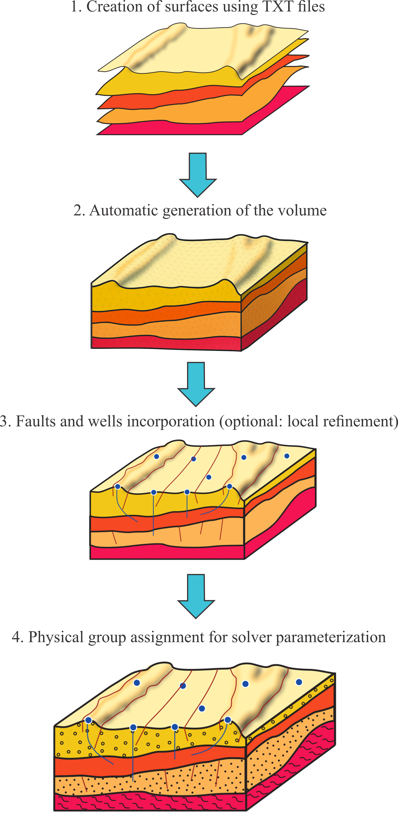

# **Geo2Gmsh**


Geo2Gmsh is a Python-based workflow for automated geological mesh generation using Gmsh.

It provides a streamlined solution for geoscientists conducting numerical simulations using the Finite Element Method (FEM) by enabling the construction of realistic geological meshes through high-level functions.


Key features, including topography and geological interfaces, can be directly incorporated into the mesh, together with structural elements such as faults and wells. The proposed workflow streamlines mesh generation while lowering the barrier to entry for users with limited experience in mesh construction.


#### **🌍 Overview**


Geo2Gmsh enables the automated generation of 3D unstructured geological meshes from simple input files.

The workflow operates on text files (.txt) containing triplets of spatial coordinates (x, y, z) representing points that define:


* Horizontal or near-horizontal surfaces representing topography or lithological interfaces
* Steep surfaces representing faults
* Linear trajectories representing wells


###### **Key capabilities include:**


* Automatic construction of geological surfaces and volumes
* Integration of faults and wells into the mesh
* Local refinement around geological features
* Assignment of physical group identifiers for use in external numerical solvers
* Export of mesh files in common formats (e.g., .msh, .vtk, etc)


As a result, Geo2Gmsh offers a reproducible and efficient pipeline for the generation of meshes suitable for geoscientific simulations.


#### **📦 Repository Structure**


```

Geo2Gmsh/

│

├── Geo2Gmsh.py                 # Core module with mesh generation functions

├── test\_checksum.py            # Run a test of the examples meshes to ensure reproducibility

├── README.md                   # Project overview and instructions

├── LICENSE                     # License information

├── environment.yml             # Conda environment configuration

├── requirements.txt            # Python dependencies

├── docs/                       # Documentation folder

│   ├── images/                 # Folder for images used in documentation

│   ├── user\_guide.md           # Detailed user guide for Geo2Gmsh

│

└── examples/                   # Folder with example workflows

	 ├── overview/               # Example 1: Overview example workflow

   	 │   ├── run\_overview.py     # Executable workflow

	 │   ├── master\_script.ipynb # Interactive notebook to configure and customize workflow

	 │   ├── outputs/            # Folder for generated results (e.g., .msh, .vtk)

	 │   └── data/               # Input datasets (.txt)

	 │       ├── layers/         # Interface definitions from (x, y, z) coordinate triplets

 	 │       ├── wells/          # Well trajectory data from (x, y, z) coordinate triplets

	 │       └── faults/         # Fault traces defined from (x, y, z) coordinate triplets

	 │

	 ├── test\_ringvent/           # Example 2: Ringvent example workflow

	 │   ├── run\_ringvent.py      # Executable workflow

	 │   ├── master\_script.ipynb

	 │   ├── outputs/

	 │   └── data/

	 │       ├── layers/

	 │       ├── wells/

	 │       └── faults/

	 │

	 └── test\_llanos/             # Example 3: Llanos example workflow

	       ├── run\_llanos.py        # Executable workflow

	       ├── master\_script.ipynb

	       ├── outputs/

	       └── data/

	           ├── layers/

	           ├── wells/

	           └── faults/

```

Each example is self-contained and fully reproducible.


# **Quick Start**


#### **⚙️ Installation**


After installing Anaconda (version 23.11.0 or later) on your system, follow these steps from an Anaconda Prompt:


1. ###### **Clone repository**


git clone http://github.com/Geoprimo/Geo2Gmsh.git


###### **2. Navigate into the repository**


cd Geo2Gmsh


###### **3. Create environment**


To create the execution environment, run one of the following options:


###### **Method 1**


conda create -n Geo2Gmsh python=3.11 -y

conda activate Geo2Gmsh

pip install -r requirements.txt


###### **Method 2**

###### 

conda env create -f environment.yml

conda activate Geo2Gmsh

&#x20;

#### **▶️ Running the Workflows**


Each example can be executed directly from the Anaconda Prompt without modifying the source code.


###### **Example 1**

&#x20;

cd examples/overview

python run\_overview.py


###### **Example 2**


cd examples/test\_ringvent

python run\_ringvent.py


###### **Example 3**


cd examples/test\_llanos

python run\_llanos.py


Then,


python test\_checksum.py


#### **🔄 Workflow Description**


The workflow is provided in two complementary formats:


* master\_script.ipynb

This is the main interactive notebook where the workflow is configured and adapted to specific datasets. It is intended for users who want to modify input data, parameters, or geological settings.


* run\_overview.py

This script version of the notebook is designed for execution from the terminal. It allows users to run predefined examples directly, without modifying the code.


To apply the workflow to a different dataset or case study, users should update the master\_script.ipynb accordingly and, if necessary, adapt the corresponding .py script


#### **➡️ Pipeline Overview**


Each master\_script.ipynb and run\_overview.py script executes a complete, reproducible pipeline consisting of the following steps:


1\. Parsing and triangulating geological surfaces

2\. Building closed volumetric models

3\. Embedding well geometries

4\. Embedding fault geometries

5\. Applying local mesh refinement

6\. Assigning physical IDs

7\. Exporting to standard formats (e.g., .msh, .vtk, etc.)




#### **📂 Input Data**


## Input Data

Each example comes with input files organized into specific folders within the data/ directory:


* **layers/** – Contains files describing geological layers.
* **wells/** – Contains well data files.
* **faults/** – Contains fault data files.


For detailed descriptions of the input file formats and example files, please refer to the **User Guide** located in the docs/ directory.


#### **📤 Output Files**


Generated meshes are written to the outputs/ directory:


* .msh  native Gmsh format
* .vtk  visualization and simulation format


If additional file formats (e.g., .exo) are required, the meshio package can be used to export meshes to other supported extensions.


#### **🧠 Code Structure**


The file Geo2Gmsh.py contains the core functionality:


* create\_surface → generate near-horizontal geological surfaces


* volume\_generation → build lateral surfaces to enclose volumes


* add\_fault → define fault geometries


* add\_well → define well trajectories


* local\_refinement → apply mesh refinement around interfaces, faults and wells


* physical\_group → assign physical regions


The module is imported directly within each workflow script.


#### **🔁 Reproducibility**


Each example workflow includes all required components for end-to-end reproducibility:


\- Raw input files (data/)

\- Executable scripts (run\_\*.py)

\- Output files (outputs/)

\- Environment specifications (requirements.txt, environment.yml)


To ensure consistent results across platforms, a checksum-based validation is provided.


After running any workflow, results can be verified using:


python test\_checksum.py


This script verifies that generated meshes match reference outputs.


#### **🧩 Requirements**


\- Python = 3.11.15

\- Gmsh = 4.15.1

\- numpy = 2.4.3

