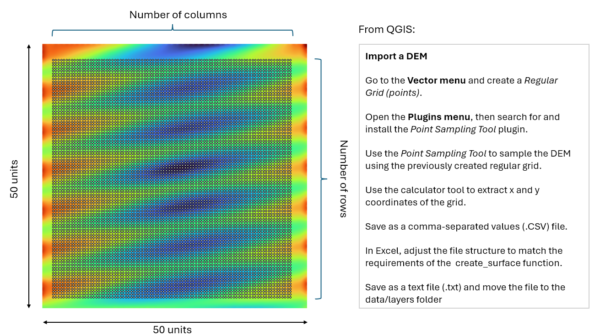
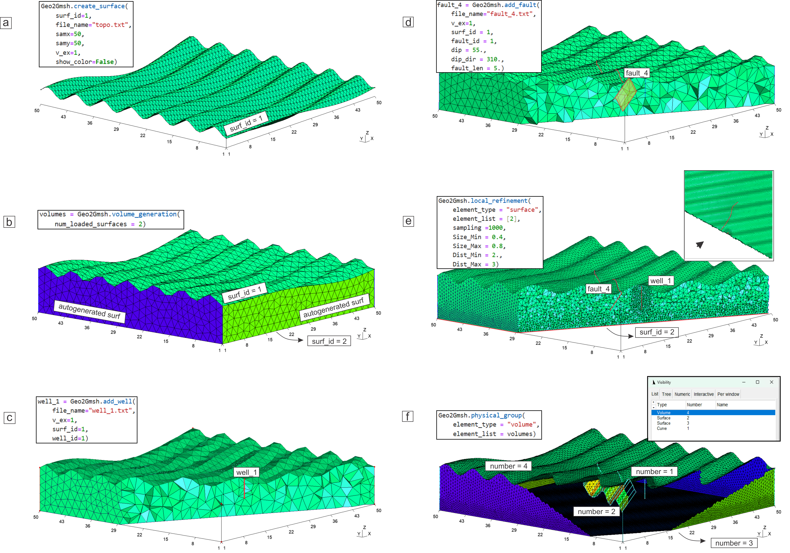

# User guide


## 1 .Introduction


This guide provides detailed instructions for using Geo2Gmsh to generate geological meshes for numerical simulations.

It includes workflow explanations, input data specifications, and step-by-step instructions.


## 2\. Workflow Overview


We designed Geo2Gmsh as a modular and scriptable Python-based workflow that automates the generation of unstructured 3D meshes from geological and geophysical data. The workflow integrates Gmsh via its Python API and allows users to process input data derived from GIS software, geological modeling tools, or general computing environments such as MATLAB.


The workflow was implemented on Jupyter Notebook (https://jupyter.org), an open-source application for creating and sharing computational notebooks that combine executable code, plain text, data, visualizations, and interactive elements, leveraging its capabilities for coding, data exploration, visualization, and application prototyping. The workflow is divided into the following stages:


1\. Parsing and triangulating geological surfaces

2\. Building closed volumetric models

3\. Embedding well geometries

4\. Embedding fault geometries

5\. Applying local mesh refinement

6\. Assigning physical IDs

7\. Exporting mesh files


Three examples are provided for testing Geo2Gmsh: overview, test\_ringvent, and test\_llanos. As all cases follow the same underlying workflow, the overview example is described in detail, while the remaining examples are based on the same procedure with different datasets and geological settings.


## 3\. Input data


Geo2Gmsh generates geological meshes from simple text-based input files. Each file must follow a predefined structure so that Geo2Gmsh functions can interpret it as geological surfaces, faults, or well trajectories. These elements are explicitly embedded into the final mesh.


#### 3.1 Surface Definition (create\_surface)


The create\_surface function requires a text file with the following structured format, including a header row:


```
ID      x	         y	         z

1	3.062124248	3.062124248	1.020297847

2	3.160320641	3.062124248	1.006273848

3	3.258517034	3.062124248	0.991875861

4	3.356713427	3.062124248	0.976597975

...
```


Each row contains:


ID: Unique identifier for each point

x, y, z: Spatial coordinates defining the surface geometry


These points represent a discretized sampling of the geological surface (topography or interface). The full set of points is used to reconstruct and triangulate the surface during mesh generation.


#### 3.2 Well definition (add\_well)


The add\_well function defines well trajectories that may intersect multiple geological surfaces. To ensure correct embedding and avoid topological inconsistencies, intersection points must be explicitly identified in the input file.


The required format is:


```
ID      x	        y	         z

1       34.95501375	12.09621247	-0.75742

NaN     34.95501375	12.09621247	-1.5124452

NaN     34.95501375	12.09621247	-2.5124452

NaN     34.95501375	12.09621247	-3.5124452

2       34.95501375	12.09621247	-4.5124452
```


Each row contains:


ID: Identifier indicating whether the point corresponds to a surface intersection

x, y, z: Spatial coordinates along the well trajectory


The ID field is interpreted as follows:


A numeric value (e.g., 1, 2) indicates that the point coincides with a surface of the corresponding ID

NaN indicates that the point does not correspond to a surface intersection


The well trajectory must be discretized continuously from the surface to the target depth.


#### 3.3 Fault definition (add\_fault)


The add\_fault function requires sampling the intersection between the fault and a geological surface. The sampled points are stored in a text file with the following format:


```
ID	x	        y	        z

1	16.89398176	10.70100959	-1.2977821

2	17.99037703	12.03575166	-1.0460582

3	18.89609486	13.22748566	-0.47866338

4	19.42045782	14.32388093	0.23440473

5	20.0401595	15.22959876	0.39276455
```


Each row contains:


ID: Unique identifier for each sampling point

x, y, z: Spatial coordinates defining the sampled fault trace


Additional geometric parameters such as dip, dip direction, and fault height are defined as function arguments and are not included in the input file.

&#x20;

## 4\. Generating Input Files


#### 4.1 Preprocessing for create\_surface


For the overview example, a synthetic topographic surface was generated using the following analytical expression:


z(ID,x) = sin(ID/7) + cos(x/9)


where ID is the point identifier and x is the x-coordinate. The resulting point dataset was imported into QGIS (https://qgis.org/) to generate a digital elevation model (DEM), which was subsequently resampled on a regular grid to simulate typical DEM-based sampling. The final sampled points were then exported as structured input files compatible with the create\_surface function. The number of rows and columns must be considered, as these values are required input parameters for surface reconstruction within the function.





#### 4.2 Preprocessing for add\_well


For the overview example, a synthetic well trajectory was defined by manually constructing a text file. A point located on the topographic surface was specified as the intersection between the well and the surface. Four additional points were then defined at depth, with a vertical spacing of one unit between consecutive points.


Figure X. Example of well trajectory defined in a text file.


Although the well is assumed to be vertical in this example, the methodology is fully general and supports directional wells, including trajectories intersecting multiple geological surfaces.


#### 4.3 Preprocessing for add\_fault


For the generation of the input text file, the previously created DEM was sampled along a synthetic fault trace. In this workflow, faults are defined as intersecting a single reference surface. This surface is typically the topography, although faults can also be associated with subsurface geological interfaces. In all cases, the fault definition is constructed from the reference surface downward.


Figure X. DEM showing the sampling of points along the fault trace and the resulting input data.


## 5\. Core functions


Geo2Gmsh provides a set of high-level functions that define the core operations of the mesh generation workflow. These functions are called within the master\_script and are responsible for constructing geological surfaces, generating volumes, and embedding structural features such as wells and faults.


The execution of these functions follows a predefined workflow implemented in the Jupyter Notebook. Core routines related to Gmsh initialization, meshing, refinement, and physical group assignment are already included in the script and should not be modified. Users interact with the workflow primarily through the Geo2Gmsh functions described below.


#### 5.1 create\_surface function


In a Jupyter Notebook, the create\_surface function is called using the following syntax:


**Geo2Gmsh.create\_surface (1, “layer\_1.txt”, 448, 448, 1, False)**

Notice the use of the dot notation to call the function. This instruction creates a surface with ID number **1**; the surface is rendered from a discrete series of values stored in the file layers/**layer\_1.txt** in the local directory; the values are defined on a regular orthogonal grid of **448** rows by **448** columns. The fifth entry specifies that the surface height must be scaled by a factor of **1** (vertical exaggeration). Enabling the last parameter by setting it to True allows the rendering of the surface using an interpolated color palette based on the node elevation. In our example, we disabled this option by setting it as **False**. Once the function is executed, a pop-up window will display the output (Fig. 1a).


#### 5.2 volume\_generation function


In a Jupyter Notebook, the volume\_generation function is easily called:


**Geo2Gmsh.volume\_generation (2)**

The command above instructs Gmsh to build a volumetric mesh of polyhedra. The value passed to the function as argument (in our case **2**) is the number of interfaces in the model’s domain. The minimum number of surfaces accepted by the function is 2. In our example, the model domain is bounded by the Earth’s free surface, which we assigned the ID number **1**; the second one is a planar surface placed at –8 elevation units, which we assigned the ID number **2** (the number of surfaces passed to the function). With this information, the function is executed and returns a list of polyhedra representing the interior region of the model.  The output is shown in Fig. 1b.


#### 5.3 add\_well function


In a Jupyter Notebook, calling the add\_well function requires specifying certain parameters:


**Geo2Gmsh.add\_well (“well\_1.txt”, 1, 1)**

This function reads the text file /wells/**well\_1.txt** and connects the sampling points by straight line segments. To remain consistent with the create\_surface function in our example, the surface height is scaled by a factor of **1** (second argument). The well is assigned to the unique ID number **1** (third argument). The function returns a list of lines that follows the well trajectory; the output is shown in Fig. 1c.


#### 5.4 add\_fault function


Within a Jupyter Notebook, the add\_fault function is called in the following way:


**Geo2Gmsh.add\_fault (“fault\_4.txt”, 1, 1, 4, 65, 280, 5)**

The (x, y, z) triplets in /faults/**fault\_4**.txt are imported as points in Gmsh and connected by straight lines to represent the superficial fault trace. Once again, the scaling factor is set to **1** (second argument); the third argument specifies that the free surface of the Earth has a surface ID of **1**, and the fault is assigned the unique ID number **4** (fourth parameter). The fault plane is then created by extruding the curve, using a dip = **65**, dip direction = **280** (degrees), and fault height = **5** of length units (parameters 5-7). After its execution, this function returns a list of planar surfaces that represent the entire fault plane. The graphical result is shown in Fig. 1d.


#### 5.5 local\_refinement function


In a Jupyter Notebook, local\_refinement requires the following parameters:

&#x20;

**Geo2Gmsh. local\_refinement (“surface”, \[2], 1000, 0.4, 0.8, 2, 3)**

Geo2Gmsh defines three custom object types: “surface”, “fault”, and “well”, to support local refinement. In the example above, the resolution is increased around the “surface” object type (first parameter), with ID 2 (second parameter). Notice the use of quotation marks and square brackets in the function arguments to achieve this. In our example in Fig. 1b, this will refine the bottom part of the model. The node interpolation process is guided by the following series of parameters: 1000 sampling points, a minimum element size of 0.4, a maximum element size of 0.8, a minimum distance of 2, and a maximum distance of 3. The minimum element size is enforced within the minimum distance from the target object, whereas the maximum element size is reached beyond the maximum distance. Between these distances, a transition zone is defined in which the element size increases smoothly from 0.4 to 0.8. (see the section 10 for further details on these parameters). Fig. 1e illustrates the mesh obtained after applying the local refinement routine to well\_1, fault\_4, and surface \[2].


#### 5.6 physical\_group function


In a Jupyter Notebook, the physical\_group function is invoked as follows:

&#x20;

**Geo2Gmsh. physical\_group (“volume”, volumes)**

Similarly to the previous function, the physical\_group routine requires specifying an object type, which can be one of the following: volume, surface, fault, or well. In this example, a physical group ID is assigned to a “volume” object type as indicated by the first parameter. The second parameter defines the list of ID elements to be grouped within the physical group. Here, the variable volumes contain a single element, \[1], corresponding to the ID of the only volume created so far. All elements belonging to a physical group are then exported as part of the mesh where the appropriate boundary conditions and material parameter values can be assigned. For further clarification on assigning physical group IDs to wells and faults, refer to the section 10.





## 6\. Basic usage (master script)


The master\_script is organized into eight main sections:


1\. Libraries: Section where the required Python libraries are imported.

Do not modify.

2\. Start: Initialization of Gmsh, where the model name is defined.

Modify only the model name as needed for your project.

3\. Functions and mesh settings: Geological features (surfaces, wells, and faults) are loaded using the Geo2Gmsh functions.

Users must modify the function parameters to point to their own input text files and adjust scaling, IDs, or other relevant settings.

4\. Refinement field settings: Includes routines for the automatic generation of local refinement fields, as well as parameters controlling global numerical precision and mesh refinement outside these regions.

Do not modify.

5\. Physical group assignment: Assignment of physical groups to surfaces, wells, and faults using the physical\_group function, for subsequent use in numerical simulations.

Only entities assigned to a physical group are exported in the mesh file.

Users should modify this section to assign physical groups to desired features. For example, assign a specific group to a well, fault, or surface to impose boundary conditions in subsequent simulations.

6\. Meshing: This section consists of the lines of code where the mesh generation routine of Gmsh is invoked. Additionally, some lines for visualization settings are included.

Do not modify.

7\. Output format: In this section, the output file name and mesh file format are specified. If a physical group is assigned to the entire volume, the exported mesh will include the complete model.

If physical groups are assigned only to specific features (wells, faults, or surfaces), the exported mesh will contain only the elements belonging to these groups.


&#x20;


## 7\. outputs and visualization


After running the workflow, a Gmsh window will open automatically, displaying a render of the generated mesh using the .msh file.


Additionally, a .vtk version of the mesh is created in the outputs/ folder. This file can be opened in popular visualization and scientific simulation software such as ParaView (https://www.paraview.org) to explore the mesh, inspect geological features, and extract relevant data for simulation workflows.


For reproducibility, you can verify that the generated meshes match the reference outputs by running:


python test\_checksum.py


From the Anaconda Prompt. This script compares the generated mesh with the reference version, ensuring that the workflow executes correctly and consistently across different systems (see README file).

## 


## 8\. Provenance and Preprocessing of Input Data


Geo2Gmsh workflows rely on structured input files representing geological surfaces, wells, and faults. The data included in the llanos and Ringvent examples originate from real geological datasets:


Surfaces:


ringvent: high-resolution bathymetry from [Teske et al. (2021)](https://doi.org/10.14379/iodp.proc.385.105.2021) was used to define the topography.

llanos: topography from a digital elevation model obtained via [GeoMapApp](https://www.geomapapp.org), and Moho and basement surfaces derived from [CRUST1.0](https://igppweb.ucsd.edu/~gabi/crust1/laske-egu13-crust1.pdf) and interpolation of well data ([Buitrago et al., 2024](https://doi.org/10.1016/j.tecto.2024.230413); Alfaro et al., 2015).

DEMs were resampled on regular grids to generate structured coordinate triplets suitable for the create\_surface function.


Wells:


ringvent: wells drilled at sites U1547 and U1548, integrated as vertical trajectories using log reports and core-recovery data ([Teske et al., 2021](https://doi.org/10.14379/iodp.proc.385.105.2021)).

llanos: eleven well trajectories obtained from publicly available well data, discretized along their depth to intersect model surfaces ([Buitrago et al., 2024](https://doi.org/10.1016/j.tecto.2024.230413)).


Faults:


llanos: basement faults sampled from structural maps ([López-Ramos et al., 2022](https://doi.org/10.29047/01225383.380)) and modeled as vertical planes with defined height (10 km).


Preprocessing steps common to all examples:


Surfaces and faults were discretized into point triplets (x, y, z) and stored in .txt files according to the format required by Geo2Gmsh.

Well trajectories were discretized continuously from the surface to the target depth, marking intersections with surfaces using the ID field.

All input files were organized into the data/ directory with subfolders layers/, wells/, and faults/ to support reproducibility.


## 9\. Step-by-step workflow


This section presents the typical workflow for generating a geological mesh using Geo2Gmsh, showing how the input files, core functions, and Gmsh operations are connected.


1. Prepare Input Files
* Generate or collect input data for surfaces, wells, and faults in .txt format.
* Ensure surfaces are sampled on a regular or structured grid.
* Mark well-surface intersections explicitly using IDs.
* Sample faults along a reference surface and store (x, y, z) points.
* Organize files in the data/ folder, using subdirectories layers/, wells/, and faults/.


2\. Initialize the Model

* Import required Python libraries in the master script.
* Initialize Gmsh and define the model name.
* Set global parameters such as vertical exaggeration, mesh size, and physical group counters.


3\. Load Geological Surfaces

* Call create\_surface for each surface in top-to-bottom order.
* Provide the input file path, grid dimensions, vertical exaggeration, and optional color display.
* Surfaces are automatically triangulated and stored for later use.


4\. Generate Volumes

* Call volume\_generation with the number of surfaces loaded.
* This creates vertical connections between surfaces and generates fully enclosed 3D volumes.
* The function returns a list of volume IDs for further reference.


5\. Embed Wells

* Call add\_well for each well trajectory.
* Provide the input file, vertical exaggeration, and well ID.
* Wells are discretized, line segments are created, and intersections with surfaces and volumes are embedded.
* Returned line segments can be used for refinement and physical group assignment.


6\. Embed Faults

* Call add\_fault for each fault.
* Provide the input file, vertical exaggeration, surface ID, fault ID, dip, dip direction, and fault length.
* The function generates extruded surfaces representing the fault plane.
* The returned surfaces can be used for refinement and physical group assignment.


7\. Apply Local Mesh Refinement

* Call local\_refinement for selected wells, faults, or surfaces.
* Define refinement parameters such as sampling, minimum/maximum element size, and influence radii.
* Local refinement fields are automatically created in Gmsh to improve mesh quality near critical features.


8\. Assign Physical Groups

* Call physical\_group to define groups for wells, faults, surfaces, or volumes.
* Unique IDs are assigned for each group.
* Only elements assigned to a physical group are exported for numerical simulations or further processing.


9\. Generate the Mesh

* Execute the meshing routine in Gmsh.
* Optionally visualize surfaces, volumes, wells, and faults.
* The .msh file and .vtk version of the mesh are automatically saved in the outputs/ folder.


10\. Verify and Visualize Outputs

* Open the .vtk file in ParaView or similar software to inspect the mesh.
* Run python test\_checksum.py to compare generated meshes with reference outputs for reproducibility.


Note: Following this workflow ensures that surfaces, wells, and faults are correctly embedded, volumes are closed, local refinement is applied, and physical groups are assigned for downstream simulations.


## 10\. Geo2Gmsh Function Syntax


Here we present the syntax of each Geo2Gmsh function, including its name, argument syntax, supported variable types, argument meanings, and the sequence of steps performed.


The following section details the key Geo2Gmsh functions, their arguments, and the steps each performs. This helps users understand how to interact with the scripts and prepare input data correctly.


#### 10.1 create\_surface(file, n\_rows, n\_cols, scale, show\_colors)


```
Argument	| Description

file		| Name of the .txt file containing (x, y, z) coordinates of the surface
n_rows		| Number of rows in the grid used to reconstruct the surface
n_cols		| Number of columns in the grid used to reconstruct the surface
scale		| Vertical exaggeration factor applied to the z values
show_colors	| If True, the surface is rendered with interpolated colors based on elevation
```

Steps performed:


Reads and parses the input file containing (x, y, z) points.

Creates the base surface from the grid corner points.

Adds nodes for each (x, y, z) triplet.

Builds the triangulation by dividing each grid cell into two triangles.

Applies optional vertical exaggeration.

Renders the surface with colors if show\_colors is set to True.


Note: Points (x, y, z) must be ordered west-to-east and north-to-south. Surfaces should be loaded one by one from top to bottom in increasing ID order (1, 2, 3, …).


#### 10.2 volume\_generation(num\_loaded\_surfaces)


```
Argument	        | Description

num_loaded_surfaces	| Number of surfaces loaded using create_surface()
```

Steps performed:


Creates vertical lines connecting vertices of consecutive surfaces.

Constructs lateral surfaces that enclose the volumes.

Returns a list of volume IDs generated, used as input for subsequent functions.


#### 10.3 add\_well(file\_name, v\_ex, well\_id)


```
Argument	| Description

file_name	| .txt file with the well trajectory
v_ex		| Vertical exaggeration factor; must match create_surface
well_id		| Unique identifier for the well
```

Steps performed:


Reads and parses the well trajectory (x, y, z) points and surface intersection IDs.

Constructs line segments connecting consecutive points.

Embeds intersection points into their corresponding geological surfaces.

Embeds each line segment into the appropriate volume.

Returns a list of line segments representing the well.


Note: Points must be ordered from shallow to deep, with the first point coinciding with the surface.


#### 10.4 add\_fault(file\_name, v\_ex, surf\_id, fault\_id, dip, dip\_dir, fault\_len)


```
Argument	| Description

file_name	| .txt file with the fault trace
v_ex		| Vertical exaggeration factor; must match create_surface
surf_id		| Surface ID intercepted by the fault
fault_id	| Unique identifier for the fault
dip		| Dip angle (degrees) of the fault relative to horizontal
dip_dir		| Dip direction (azimuth in degrees from north to down-dip)
fault_len	| Fault length (same units as input coordinates)
```


Steps performed:


Reads and parses the (x, y, z) points from the file.

Generates curves representing the fault trace.

Computes extrusion vectors based on dip, dip\_dir, and fault\_len.

Returns the list of surfaces composing the fault.


Note: Ensure the fault points are ordered along the trace and sampled at a resolution similar to the intersecting surface to avoid topological issues.


#### 10.5 local\_refinement(element\_type, element\_list, sampling, size\_min, size\_max, dist\_min, dist\_max)


```
Argument	| Description

element_type	| Type of element: "well", "fault", or "surface"
element_list	| List of IDs or outputs from previous functions specifying the feature to refine
sampling	| Number of points sampled along the feature to guide refinement
size_min	| Minimum element size allowed
size_max	| Maximum element size allowed
dist_min	| Minimum radius around the feature where size_min is enforced
dist_max	| Maximum radius of influence for the refinement
```

Steps performed:


Creates a local refinement field based on the element type.

Assigns unique IDs to avoid repetition in Gmsh.


Note: See the case study section for examples of how to provide element\_list correctly.


#### 10.6 physical\_group(element\_type, element\_list)

```
Argument	| Description

element_type	| Type of element: "well", "fault", "surface", or "volume"
element_list	| List of elements or IDs to include in the physical group
```


Steps performed:


Creates a physical group in Gmsh for the specified element type.

Assigns a unique ID to each group to enable node recovery or boundary condition application.

Ensures that nodes of interest are included in at least one physical group.


Note: To export the full mesh, include all volumes in a physical group.

